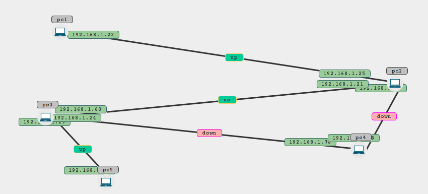

# boudis

using java swing and java graphics to represent a network topology inside a jpanel

you can find an rxample of using and some screenshots and the jar file on this website <a href="http://devgeeks.site/2017/06/22/boudis-a-java-swing-based-library-to-display-and-view-network-topologies/">devgeeks.site</a>

